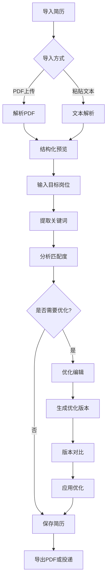
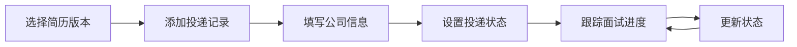
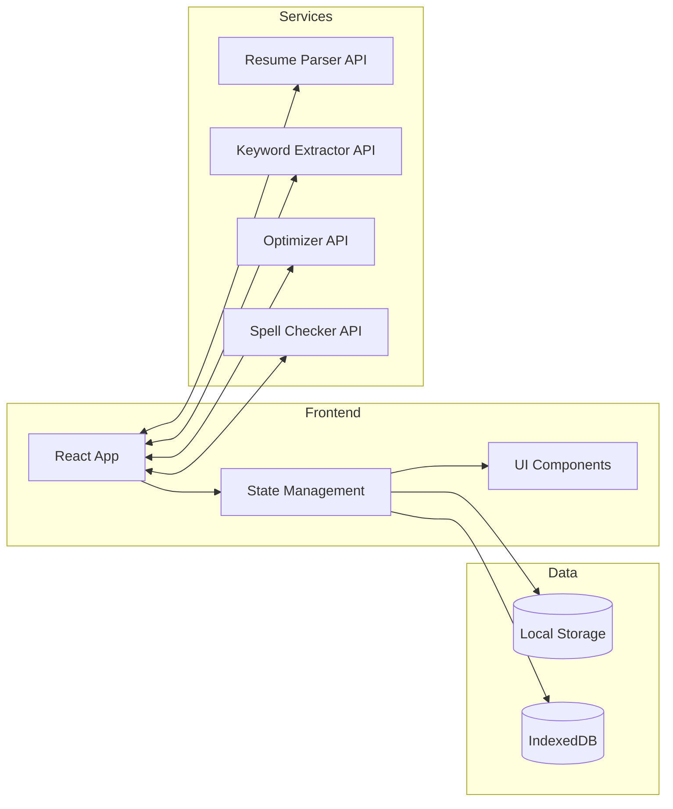

# 简历优化助手 PRD 文档

## 1. 产品概述

**简历优化助手**是一款面向应届生的在线简历优化工具，帮助用户在投递前快速打磨简历，提升求职竞争力。通过AI技术分析职位需求、识别简历问题、提供优化建议，让简历更具针对性和说服力。

- **目标用户**：即将毕业或刚毕业的大学生、研究生
- **核心价值**：快速生成针对不同岗位的简历版本，量化表达经历，突出与岗位的匹配度
- **市场定位**：轻量级、专业级、即时可用的简历优化工具

## 2. 核心功能

### 2.1 用户角色

| 角色 | 注册方式 | 核心权限 |
|------|----------|----------|
| 访客用户 | 无需注册 | 可使用简历导入和基础优化功能，结果不保存 |
| 注册用户 | 邮箱/手机号注册 | 保存所有简历版本、投递记录，享受完整功能 |

### 2.2 功能模块概览

1. **简历导入页**：上传 PDF 或粘贴文本，解析并结构化展示
2. **职位匹配页**：输入目标岗位，提取关键词，分析匹配度
3. **优化编辑页**：标出空泛表达，给出量化改写建议，生成优化版本
4. **版本对比页**：并排对比修改前后差异，支持一键应用
5. **投递记录页**：记录投递公司和结果，查看简历版本关联

### 2.3 页面详情

#### 2.3.1 简历导入页

| 模块名称 | 功能描述 |
|----------|----------|
| 导入方式选择 | 支持拖拽上传 PDF 文件，或粘贴文本内容 |
| PDF 解析区 | 实时解析 PDF 内容，展示原始文本 |
| 结构化预览 | 将简历内容分为：基本信息、教育背景、工作经历、项目经历、技能列表等模块 |
| 素材库入口 | 提供快速访问项目经历素材库的入口 |
| 错误提示 | 解析失败时显示友好提示，建议重新上传或手动输入 |

#### 2.3.2 职位匹配页

| 模块名称 | 功能描述 |
|----------|----------|
| 岗位搜索 | 输入目标岗位名称（如"前端工程师"、"产品经理"） |
| 关键词提取 | 自动从岗位描述中提取关键词（技术栈、软技能、职责要求） |
| 匹配度分析 | 计算当前简历与目标岗位的匹配度百分比 |
| 缺失关键词 | 高亮显示简历中缺失的重要关键词 |
| 优化建议 | 根据关键词给出简历内容调整建议 |

#### 2.3.3 优化编辑页

| 模块名称 | 功能描述 |
|----------|----------|
| 空泛表达标记 | 自动标红常见空泛表达（如"负责...相关工作"、"表现优秀"） |
| 量化改写建议 | 对每条经历提供量化改写示例（如将"提升了用户体验"改为"优化了3个核心流程，用户满意度提升25%"） |
| 时间线展示 | 以时间轴形式展示教育和工作经历，支持拖拽调整顺序 |
| 版本管理 | 保存多个优化版本，支持版本命名和备注 |
| 错别字检查 | 实时检测中文错别字和语法错误 |
| 素材库引用 | 从素材库中选择经历片段插入简历 |
| 设为默认简历 | 将当前版本设为默认简历，下次导入自动加载 |

#### 2.3.4 版本对比页

| 模块名称 | 功能描述 |
|----------|----------|
| 并排对比 | 左右分栏显示原版和优化版简历 |
| 差异高亮 | 用颜色区分新增（绿色）、删除（红色）、修改（黄色）内容 |
| 差异统计 | 显示修改字数、删除字数、优化点数等统计数据 |
| 一键应用 | 确认后一键应用所有优化建议 |
| 逐条应用 | 支持逐条选择应用或忽略优化建议 |
| 版本切换 | 支持在多个版本间快速切换对比 |

#### 2.3.5 投递记录页

| 模块名称 | 功能描述 |
|----------|----------|
| 投递列表 | 展示所有投递记录（公司名称、岗位、投递时间、当前状态） |
| 状态管理 | 支持设置：待笔试、面试中、offer、拒绝、无反馈等状态 |
| 简历版本关联 | 每条投递记录关联一个简历版本，可追溯 |
| 添加备注 | 支持添加面试反馈、注意事项等备注信息 |
| 统计分析 | 提供投递成功率、面试转化率等统计图表 |

#### 2.3.6 项目经历素材库

| 模块名称 | 功能描述 |
|----------|----------|
| 素材列表 | 展示所有项目经历素材，支持分类和标签管理 |
| 添加素材 | 支持手动添加新素材，包含项目名称、描述、技术栈、成果指标 |
| 素材编辑 | 编辑、删除已有素材 |
| 一键插入 | 从素材库选择素材，一键插入到简历对应位置 |
| 智能推荐 | 根据当前简历内容，智能推荐相关素材 |

## 3. 核心流程

### 3.1 主流程：简历优化



### 3.2 投递管理流程



## 4. 用户界面设计

### 4.1 设计风格

#### 视觉定位
- **风格方向**：专业简约 + 科技感 + 活力点缀
- **设计理念**：让用户感受到工具的专业性和效率，同时保持友好的使用体验

#### 色彩方案
- **主色调**：#2563EB（科技蓝）- 传递专业、可信赖
- **辅助色**：#10B981（生机绿）- 用于成功状态、优化建议
- **警示色**：#F59E0B（活力橙）- 用于待处理、注意事项
- **强调色**：#8B5CF6（创新紫）- 用于关键操作、亮点展示
- **背景色**：#F8FAFC（极浅灰）- 页面背景
- **文字色**：#1E293B（深灰）- 主要文字，#64748B（中灰）- 次要文字

#### 按钮样式
- **主按钮**：圆角8px，蓝色填充，白色文字，带微妙阴影
- **次按钮**：圆角8px，蓝色描边，透明背景
- **文字按钮**：无边框，蓝色文字，悬停时显示背景
- **操作按钮**：小尺寸，圆角6px，用于表格操作

#### 字体规范
- **标题字体**：[Noto Sans SC](https://fonts.google.com/specimen/Noto+Sans+SC)（思源黑体）- 清晰、现代
- **正文字体**：[Noto Sans SC](https://fonts.google.com/specimen/Noto+Sans+SC)
- **代码/数据**：JetBrains Mono - 用于数字和关键指标展示
- **字号层级**：
  - H1: 32px, 700
  - H2: 24px, 600
  - H3: 20px, 600
  - 正文: 16px, 400
  - 辅助: 14px, 400
  - 小字: 12px, 400

#### 布局风格
- **整体布局**：顶部导航 + 侧边菜单 + 主内容区
- **卡片设计**：白色背景，圆角12px，轻微阴影，16px内边距
- **间距系统**：基于8px网格，常见间距：8px、16px、24px、32px、48px
- **响应式策略**：桌面优先，支持平板和手机的基本适配

#### 图标风格
- **图标库**：Lucide React（线性风格，2px描边）
- **状态图标**：成功✓、失败✗、警告⚠、信息ℹ
- **功能图标**：清晰表达功能含义，避免过度装饰

### 4.2 页面设计详情

#### 简历导入页
- **顶部区域**：页面标题 + 简短说明
- **导入方式区**：两个大卡片（PDF上传、文本粘贴），悬停时轻微上浮
- **上传区域**：虚线边框，拖拽时边框变蓝色，支持点击选择文件
- **文本区**：大文本框，placeholder提示"请粘贴简历内容..."
- **预览区**：简历内容以结构化卡片形式展示

#### 职位匹配页
- **搜索区**：大输入框 + 搜索按钮，居中显示
- **匹配度展示**：圆形进度环，显示百分比，动画填充效果
- **关键词云**：关键词以标签形式展示，相关度高的字体更大、颜色更深
- **建议区**：卡片列表展示优化建议，可点击查看详情

#### 优化编辑页
- **工具栏**：顶部固定工具栏，包含保存、导出、对比等操作
- **编辑区**：左侧简历编辑，右侧实时预览
- **标记层**：空泛表达以红色下划线标记，鼠标悬停显示优化建议
- **时间线**：左侧或顶部时间轴，拖拽可调整顺序
- **素材库面板**：右侧可展开面板，支持搜索和快速插入

#### 版本对比页
- **版本选择器**：顶部标签页，切换不同版本
- **对比区**：左右分栏，同步滚动，原版和优化版对照显示
- **差异标记**：新增绿色背景，删除红色删除线，修改黄色高亮
- **统计面板**：顶部显示修改统计（新增X处，删除Y处，修改Z处）
- **操作区**：底部固定操作栏，包含一键应用和逐条应用按钮

#### 投递记录页
- **统计概览**：顶部卡片展示总投递数、面试转化率等关键指标
- **记录列表**：表格形式展示，支持筛选和搜索
- **状态标签**：不同状态用不同颜色标签（待处理-灰，面试中-蓝，offer-绿，拒绝-红）
- **添加按钮**：右下角浮动按钮，点击弹出添加表单
- **详情面板**：点击记录展开详情，显示关联简历版本和备注

### 4.3 响应式设计

- **桌面端（≥1024px）**：完整布局，菜单栏侧边显示
- **平板端（768px-1023px）**：菜单栏可收起，内容区自适应
- **移动端（<768px）**：底部标签导航，单列布局，简化操作

## 5. 技术架构

### 5.1 架构设计



### 5.2 技术栈

- **前端框架**：React 18 + TypeScript
- **构建工具**：Vite
- **样式方案**：Tailwind CSS
- **路由管理**：React Router v6
- **状态管理**：Zustand
- **PDF处理**：pdf.js
- **本地存储**：LocalStorage + IndexedDB
- **图标库**：Lucide React
- **日期处理**：dayjs

### 5.3 路由定义

| 路由路径 | 页面名称 | 功能描述 |
|----------|----------|----------|
| `/` | 首页/导入页 | 简历导入和快速开始 |
| `/match` | 职位匹配页 | 岗位关键词提取和匹配度分析 |
| `/edit` | 优化编辑页 | 简历优化编辑和素材库管理 |
| `/compare` | 版本对比页 | 修改前后对比 |
| `/delivery` | 投递记录页 | 投递管理和进度跟踪 |
| `/library` | 素材库页 | 项目经历素材管理 |
| `/settings` | 设置页 | 默认简历和偏好设置 |

### 5.4 数据模型

#### 5.4.1 简历模型

```typescript
interface Resume {
  id: string;
  name: string;
  isDefault: boolean;
  createdAt: Date;
  updatedAt: Date;
  sections: {
    basic: BasicInfo;
    education: Education[];
    experience: Experience[];
    projects: Project[];
    skills: Skill[];
  };
}
```

#### 5.4.2 投递记录模型

```typescript
interface DeliveryRecord {
  id: string;
  companyName: string;
  position: string;
  deliveryDate: Date;
  status: 'pending' | 'interview' | 'offer' | 'rejected' | 'no-response';
  resumeVersionId: string;
  notes: string;
  updatedAt: Date;
}
```

#### 5.4.3 素材库模型

```typescript
interface ProjectMaterial {
  id: string;
  title: string;
  description: string;
  techStack: string[];
  metrics: string[];
  tags: string[];
  createdAt: Date;
}
```

## 6. 核心算法

### 6.1 关键词提取算法

1. **文本预处理**：去除标点、停用词
2. **词频统计**：计算每个词的出现频率
3. **TF-IDF计算**：评估词的重要性
4. **关键词过滤**：保留名词、动词、技术术语
5. **分类整理**：分为技术栈、软技能、职责关键词

### 6.2 空泛表达识别

常见空泛表达库：
- "负责..."
- "参与..."
- "表现优秀"
- "工作认真"
- "积极配合"
- "熟练掌握"
- "精通..."

识别规则：
1. 模式匹配：检测常见空泛短语
2. 缺少数据：检测没有量化数据的描述
3. 主观表述：检测主观评价词语

### 6.3 量化改写建议

改写策略：
1. 找出可量化指标（时间、成本、效率、用户量等）
2. 计算相对提升（百分比、倍数）
3. 给出具体示例（基于行业通用数据）

## 7. 非功能性需求

### 7.1 性能需求
- 页面首次加载时间 < 3秒
- PDF解析时间 < 5秒（10页以内）
- 关键词提取时间 < 2秒
- 操作响应时间 < 200ms

### 7.2 兼容性需求
- 支持 Chrome、Firefox、Safari、Edge 最新版本
- 支持 Windows、macOS、Linux 系统
- 移动端基本功能可用（编辑功能以桌面端为主）

### 7.3 数据安全
- 所有数据存储在本地，不上传服务器
- 提供数据导出/导入功能，防止数据丢失
- 敏感信息（如联系方式）可选择脱敏显示

## 8. MVP版本范围

### 8.1 必须包含（MVP）

1. ✓ 简历导入（PDF + 文本粘贴）
2. ✓ 职位关键词提取
3. ✓ 空泛表达标记
4. ✓ 量化改写建议
5. ✓ 版本对比
6. ✓ 简历导出PDF
7. ✓ 投递记录管理
8. ✓ 默认简历设置

### 8.2 后续迭代

- 错别字检查（需接入词典API）
- 时间线编辑功能
- 项目素材库完整功能
- 多语言简历支持
- 简历模板选择
