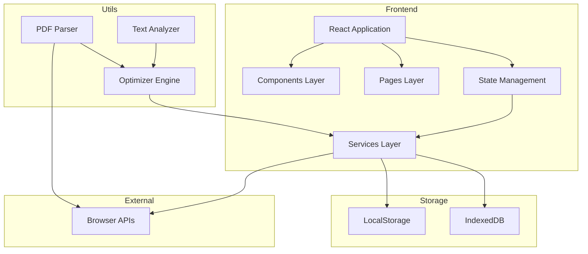

# 简历优化助手 - 技术架构文档

## 1. 架构设计

### 1.1 整体架构



### 1.2 技术栈详情

#### 前端核心
- **框架**：React 18.2+
- **语言**：TypeScript 5.0+
- **构建工具**：Vite 5.0+
- **路由**：React Router DOM 6.20+
- **状态管理**：Zustand 4.4+
- **样式**：Tailwind CSS 3.4+
- **图标**：Lucide React

#### PDF 处理
- **解析库**：pdf.js (Mozilla)
- **文本提取**：pdfjs-dist

#### 数据存储
- **临时数据**：LocalStorage
- **结构化数据**：IndexedDB (Dexie.js wrapper)
- **数据格式**：JSON

#### 开发工具
- **包管理**：pnpm
- **代码规范**：ESLint + Prettier
- **类型检查**：TypeScript strict mode

## 2. 项目结构

```
resume-optimizer/
├── public/
│   └── index.html
├── src/
│   ├── assets/
│   │   └── styles/
│   │       └── globals.css
│   ├── components/
│   │   ├── common/
│   │   │   ├── Button.tsx
│   │   │   ├── Card.tsx
│   │   │   ├── Input.tsx
│   │   │   ├── Modal.tsx
│   │   │   └── Tag.tsx
│   │   ├── resume/
│   │   │   ├── ResumeUploader.tsx
│   │   │   ├── ResumePreview.tsx
│   │   │   └── ResumeEditor.tsx
│   │   ├── matching/
│   │   │   ├── KeywordExtractor.tsx
│   │   │   ├── MatchAnalyzer.tsx
│   │   │   └── MatchScore.tsx
│   │   ├── optimization/
│   │   │   ├── VagueExpressionMarker.tsx
│   │   │   ├── QuantifySuggestor.tsx
│   │   │   └── OptimizationPanel.tsx
│   │   ├── comparison/
│   │   │   ├── VersionCompare.tsx
│   │   │   ├── DiffViewer.tsx
│   │   │   └── DiffStats.tsx
│   │   ├── delivery/
│   │   │   ├── DeliveryTable.tsx
│   │   │   ├── DeliveryForm.tsx
│   │   │   └── DeliveryStats.tsx
│   │   ├── library/
│   │   │   ├── MaterialList.tsx
│   │   │   ├── MaterialEditor.tsx
│   │   │   └── MaterialSearch.tsx
│   │   └── layout/
│   │       ├── Sidebar.tsx
│   │       ├── Header.tsx
│   │       └── Layout.tsx
│   ├── pages/
│   │   ├── HomePage.tsx
│   │   ├── MatchPage.tsx
│   │   ├── EditPage.tsx
│   │   ├── ComparePage.tsx
│   │   ├── DeliveryPage.tsx
│   │   ├── LibraryPage.tsx
│   │   └── SettingsPage.tsx
│   ├── stores/
│   │   ├── resumeStore.ts
│   │   ├── deliveryStore.ts
│   │   ├── materialStore.ts
│   │   └── settingsStore.ts
│   ├── services/
│   │   ├── pdfService.ts
│   │   ├── analyzerService.ts
│   │   ├── optimizerService.ts
│   │   └── storageService.ts
│   ├── utils/
│   │   ├── textParser.ts
│   │   ├── keywordExtractor.ts
│   │   ├── vagueExpressionDetector.ts
│   │   ├── quantifyHelper.ts
│   │   └── diffEngine.ts
│   ├── hooks/
│   │   ├── useResume.ts
│   │   ├── useDelivery.ts
│   │   ├── useMaterials.ts
│   │   └── useOptimize.ts
│   ├── types/
│   │   ├── resume.ts
│   │   ├── delivery.ts
│   │   ├── material.ts
│   │   └── common.ts
│   ├── App.tsx
│   ├── main.tsx
│   └── vite-env.d.ts
├── package.json
├── tsconfig.json
├── tailwind.config.js
├── vite.config.ts
├── .eslintrc.cjs
├── .prettierrc
└── README.md
```

## 3. 路由定义

### 3.1 路由配置

```typescript
// src/router/index.tsx
import { createBrowserRouter } from 'react-router-dom';
import Layout from '@/components/layout/Layout';
import HomePage from '@/pages/HomePage';
import MatchPage from '@/pages/MatchPage';
import EditPage from '@/pages/EditPage';
import ComparePage from '@/pages/ComparePage';
import DeliveryPage from '@/pages/DeliveryPage';
import LibraryPage from '@/pages/LibraryPage';
import SettingsPage from '@/pages/SettingsPage';

export const router = createBrowserRouter([
  {
    path: '/',
    element: <Layout />,
    children: [
      { index: true, element: <HomePage /> },
      { path: 'match', element: <MatchPage /> },
      { path: 'edit', element: <EditPage /> },
      { path: 'compare', element: <ComparePage /> },
      { path: 'delivery', element: <DeliveryPage /> },
      { path: 'library', element: <LibraryPage /> },
      { path: 'settings', element: <SettingsPage /> },
    ],
  },
]);
```

### 3.2 路由说明

| 路径 | 组件 | 功能 | 需要简历数据 |
|------|------|------|--------------|
| `/` | HomePage | 简历导入页 | 否 |
| `/match` | MatchPage | 职位匹配页 | 是 |
| `/edit` | EditPage | 优化编辑页 | 是 |
| `/compare` | ComparePage | 版本对比页 | 是 |
| `/delivery` | DeliveryPage | 投递记录页 | 否 |
| `/library` | LibraryPage | 素材库页 | 否 |
| `/settings` | SettingsPage | 设置页 | 否 |

## 4. 状态管理

### 4.1 Zustand Store 设计

#### 简历 Store

```typescript
// src/stores/resumeStore.ts
import { create } from 'zustand';
import { persist } from 'zustand/middleware';

interface ResumeState {
  currentResume: Resume | null;
  versions: ResumeVersion[];
  isAnalyzing: boolean;
  
  // Actions
  importResume: (content: string) => Promise<void>;
  updateSection: (section: string, data: any) => void;
  saveVersion: (name: string) => void;
  setDefaultResume: (versionId: string) => void;
  getDefaultResume: () => Resume | null;
}
```

#### 投递记录 Store

```typescript
// src/stores/deliveryStore.ts
import { create } from 'zustand';
import { persist } from 'zustand/middleware';

interface DeliveryState {
  records: DeliveryRecord[];
  addRecord: (record: Omit<DeliveryRecord, 'id'>) => void;
  updateRecord: (id: string, updates: Partial<DeliveryRecord>) => void;
  deleteRecord: (id: string) => void;
  getStats: () => DeliveryStats;
}
```

#### 素材库 Store

```typescript
// src/stores/materialStore.ts
import { create } from 'zustand';
import { persist } from 'zustand/middleware';

interface MaterialState {
  materials: ProjectMaterial[];
  addMaterial: (material: ProjectMaterial) => void;
  updateMaterial: (id: string, updates: Partial<ProjectMaterial>) => void;
  deleteMaterial: (id: string) => void;
  searchMaterials: (query: string) => ProjectMaterial[];
}
```

## 5. 核心服务

### 5.1 PDF 解析服务

```typescript
// src/services/pdfService.ts
import * as pdfjsLib from 'pdfjs-dist';

export async function parsePDF(file: File): Promise<string> {
  const arrayBuffer = await file.arrayBuffer();
  const pdf = await pdfjsLib.getDocument({ data: arrayBuffer }).promise;
  
  let text = '';
  for (let i = 1; i <= pdf.numPages; i++) {
    const page = await pdf.getPage(i);
    const content = await page.getTextContent();
    const pageText = content.items
      .map((item: any) => item.str)
      .join(' ');
    text += pageText + '\n';
  }
  
  return text;
}
```

### 5.2 关键词提取服务

```typescript
// src/services/analyzerService.ts
import { extractKeywords } from '@/utils/keywordExtractor';

export interface KeywordAnalysis {
  keywords: Keyword[];
  matchScore: number;
  missingKeywords: string[];
  suggestions: string[];
}

export async function analyzeJobMatch(
  resume: Resume,
  jobDescription: string
): Promise<KeywordAnalysis> {
  const resumeText = resumeToText(resume);
  const keywords = extractKeywords(jobDescription);
  const resumeKeywords = extractKeywords(resumeText);
  
  const matchScore = calculateMatchScore(keywords, resumeKeywords);
  const missingKeywords = findMissingKeywords(keywords, resumeKeywords);
  const suggestions = generateSuggestions(missingKeywords);
  
  return { keywords, matchScore, missingKeywords, suggestions };
}
```

### 5.3 优化服务

```typescript
// src/services/optimizerService.ts
import { detectVagueExpressions } from '@/utils/vagueExpressionDetector';
import { generateQuantifySuggestions } from '@/utils/quantifyHelper';

export interface OptimizationResult {
  vagueExpressions: VagueExpression[];
  quantifySuggestions: QuantifySuggestion[];
  spellingErrors: SpellingError[];
}

export function optimizeResume(resume: Resume): OptimizationResult {
  const vagueExpressions = detectVagueExpressions(resume);
  const quantifySuggestions = generateQuantifySuggestions(resume, vagueExpressions);
  const spellingErrors = checkSpelling(resume);
  
  return { vagueExpressions, quantifySuggestions, spellingErrors };
}
```

### 5.4 存储服务

```typescript
// src/services/storageService.ts
import Dexie from 'dexie';

class ResumeDatabase extends Dexie {
  resumes!: Table<Resume>;
  versions!: Table<ResumeVersion>;
  deliveries!: Table<DeliveryRecord>;
  materials!: Table<ProjectMaterial>;
  
  constructor() {
    super('ResumeOptimizerDB');
    this.version(1).stores({
      resumes: '++id, name, isDefault, createdAt',
      versions: '++id, resumeId, name, createdAt',
      deliveries: '++id, companyName, status, deliveryDate',
      materials: '++id, title, createdAt',
    });
  }
}

export const db = new ResumeDatabase();
```

## 6. 核心工具函数

### 6.1 关键词提取器

```typescript
// src/utils/keywordExtractor.ts
const STOP_WORDS = new Set([
  '的', '了', '在', '是', '我', '有', '和', '就', '不', '人', '都', '一', '一个', '上', '也', '很', '到', '说', '要', '去', '你', '会', '着', '没有', '看', '好', '自己', '这'
]);

const TECH_KEYWORDS = [
  'JavaScript', 'TypeScript', 'React', 'Vue', 'Node.js', 'Python', 'Java',
  'SQL', 'MongoDB', 'Git', 'Docker', 'AWS', 'CSS', 'HTML', 'REST API',
  'Agile', 'Scrum', 'CI/CD', 'Linux', 'Machine Learning', 'Data Analysis'
];

export function extractKeywords(text: string): Keyword[] {
  const words = tokenize(text);
  const filtered = words.filter(w => !STOP_WORDS.has(w) && w.length > 1);
  const freqMap = countFrequency(filtered);
  const keywords = convertToKeywords(freqMap);
  return sortByFrequency(keywords);
}
```

### 6.2 空泛表达检测器

```typescript
// src/utils/vagueExpressionDetector.ts
const VAGUE_PATTERNS = [
  { pattern: /负责[\s\S]{0,20}$/, label: '职责描述过于笼统', suggestion: '建议添加具体职责和成果' },
  { pattern: /参与[\s\S]{0,20}$/, label: '参与角色不明确', suggestion: '说明你在项目中的具体贡献' },
  { pattern: /表现优秀|工作认真|积极配合/, label: '主观评价', suggestion: '用具体数据替代主观描述' },
  { pattern: /熟练掌握/, label: '程度词模糊', suggestion: '建议用实际项目经验证明' },
];

export function detectVagueExpressions(resume: Resume): VagueExpression[] {
  const expressions: VagueExpression[] = [];
  
  resume.sections.experience.forEach((exp, idx) => {
    VAGUE_PATTERNS.forEach(({ pattern, label, suggestion }) => {
      if (pattern.test(exp.description)) {
        expressions.push({
          section: 'experience',
          index: idx,
          text: exp.description,
          label,
          suggestion,
          range: findMatchRange(exp.description, pattern),
        });
      }
    });
  });
  
  return expressions;
}
```

### 6.3 量化助手

```typescript
// src/utils/quantifyHelper.ts
const METRIC_PATTERNS = [
  { type: 'percentage', pattern: /(\d+)%/g },
  { type: 'number', pattern: /(\d+)个/g },
  { type: 'time', pattern: /(\d+)天/g },
];

export function generateQuantifySuggestions(
  resume: Resume,
  vagueExpr: VagueExpression[]
): QuantifySuggestion[] {
  return vagueExpr.map(expr => {
    const context = getContext(expr);
    const suggestions = generateMetricSuggestions(context);
    return {
      original: expr.text,
      suggestions,
      example: createExample(expr),
    };
  });
}

function createExample(expr: VagueExpression): string {
  const metrics = [
    '效率提升XX%',
    '用户增长XX人',
    '成本降低XX元',
    '处理XX个案例',
    '覆盖XX个模块',
  ];
  
  return `${expr.text.replace(/。$/, '')}，${metrics[Math.floor(Math.random() * metrics.length)]}`;
}
```

### 6.4 差异对比引擎

```typescript
// src/utils/diffEngine.ts
export interface DiffResult {
  type: 'added' | 'removed' | 'modified' | 'unchanged';
  content: string;
  lineNumber?: number;
}

export function compareVersions(
  original: Resume,
  optimized: Resume
): DiffResult[] {
  const originalText = resumeToText(original);
  const optimizedText = resumeToText(optimized);
  
  const originalLines = originalText.split('\n');
  const optimizedLines = optimizedText.split('\n');
  
  return computeLCS(originalLines, optimizedLines);
}
```

## 7. 组件设计

### 7.1 通用组件

#### Button 组件

```typescript
// src/components/common/Button.tsx
interface ButtonProps {
  variant: 'primary' | 'secondary' | 'ghost' | 'danger';
  size: 'sm' | 'md' | 'lg';
  loading?: boolean;
  disabled?: boolean;
  children: React.ReactNode;
  onClick?: () => void;
}
```

#### Card 组件

```typescript
// src/components/common/Card.tsx
interface CardProps {
  title?: string;
  footer?: React.ReactNode;
  hoverable?: boolean;
  children: React.ReactNode;
  className?: string;
}
```

#### Input 组件

```typescript
// src/components/common/Input.tsx
interface InputProps {
  label?: string;
  error?: string;
  size?: 'sm' | 'md' | 'lg';
  type?: 'text' | 'email' | 'password' | 'number';
  placeholder?: string;
  value?: string;
  onChange?: (value: string) => void;
}
```

### 7.2 业务组件

#### ResumeUploader 组件

```typescript
// src/components/resume/ResumeUploader.tsx
export function ResumeUploader() {
  const [mode, setMode] = useState<'pdf' | 'text'>('pdf');
  const [file, setFile] = useState<File | null>(null);
  const [text, setText] = useState('');
  const [parsing, setParsing] = useState(false);
  
  const handleFileUpload = async (e: ChangeEvent<HTMLInputElement>) => {
    const file = e.target.files?.[0];
    if (!file) return;
    
    setParsing(true);
    try {
      const text = await parsePDF(file);
      setFile(file);
      setText(text);
    } catch (error) {
      showError('PDF解析失败，请重试');
    } finally {
      setParsing(false);
    }
  };
  
  return (
    <div className="space-y-6">
      <ModeSelector mode={mode} onChange={setMode} />
      
      {mode === 'pdf' ? (
        <FileUploader onUpload={handleFileUpload} parsing={parsing} />
      ) : (
        <TextInput value={text} onChange={setText} />
      )}
    </div>
  );
}
```

#### MatchScore 组件

```typescript
// src/components/matching/MatchScore.tsx
export function MatchScore({ score }: { score: number }) {
  const color = score >= 70 ? '#10B981' : score >= 40 ? '#F59E0B' : '#EF4444';
  
  return (
    <div className="relative w-32 h-32">
      <svg className="w-full h-full transform -rotate-90">
        <circle
          cx="64"
          cy="64"
          r="56"
          stroke="#E5E7EB"
          strokeWidth="12"
          fill="none"
        />
        <circle
          cx="64"
          cy="64"
          r="56"
          stroke={color}
          strokeWidth="12"
          fill="none"
          strokeDasharray={`${score * 3.52} 352`}
          className="transition-all duration-1000"
        />
      </svg>
      <div className="absolute inset-0 flex items-center justify-center">
        <span className="text-3xl font-bold" style={{ color }}>
          {score}%
        </span>
      </div>
    </div>
  );
}
```

## 8. 页面实现

### 8.1 首页 - 简历导入页

```typescript
// src/pages/HomePage.tsx
export default function HomePage() {
  const navigate = useNavigate();
  const { importResume, currentResume } = useResumeStore();
  const [uploadMode, setUploadMode] = useState<'pdf' | 'text'>('pdf');
  const [resumeText, setResumeText] = useState('');
  
  const handleImport = async () => {
    if (!resumeText.trim()) {
      showError('请先上传或输入简历内容');
      return;
    }
    
    await importResume(resumeText);
    navigate('/match');
  };
  
  return (
    <div className="min-h-screen bg-gradient-to-br from-blue-50 to-indigo-100">
      <div className="max-w-6xl mx-auto px-6 py-12">
        <Header />
        
        <div className="mt-12 grid md:grid-cols-2 gap-8">
          <UploadCard
            mode={uploadMode}
            onModeChange={setUploadMode}
            onFileSelect={handleFileSelect}
            onTextChange={setResumeText}
          />
          
          <PreviewCard text={resumeText} />
        </div>
        
        {currentResume && (
          <div className="mt-8 flex gap-4">
            <Button variant="secondary" onClick={() => navigate('/edit')}>
              继续编辑
            </Button>
            <Button variant="primary" onClick={handleImport}>
              开始分析
            </Button>
          </div>
        )}
      </div>
    </div>
  );
}
```

### 8.2 职位匹配页

```typescript
// src/pages/MatchPage.tsx
export default function MatchPage() {
  const { currentResume } = useResumeStore();
  const [jobPosition, setJobPosition] = useState('');
  const [analysis, setAnalysis] = useState<KeywordAnalysis | null>(null);
  const [loading, setLoading] = useState(false);
  
  const handleAnalyze = async () => {
    if (!jobPosition.trim()) {
      showError('请输入目标岗位');
      return;
    }
    
    setLoading(true);
    try {
      const result = await analyzeJobMatch(currentResume, jobPosition);
      setAnalysis(result);
    } catch (error) {
      showError('分析失败，请重试');
    } finally {
      setLoading(false);
    }
  };
  
  return (
    <div className="space-y-8">
      <JobSearch onSearch={handleAnalyze} loading={loading} />
      
      {analysis && (
        <>
          <MatchScore score={analysis.matchScore} />
          <KeywordCloud keywords={analysis.keywords} />
          <MissingKeywordsList keywords={analysis.missingKeywords} />
          <SuggestionsList suggestions={analysis.suggestions} />
        </>
      )}
      
      <div className="flex gap-4">
        <Button variant="secondary" onClick={() => navigate('/')}>
          返回
        </Button>
        <Button variant="primary" onClick={() => navigate('/edit')}>
          开始优化
        </Button>
      </div>
    </div>
  );
}
```

## 9. 样式规范

### 9.1 Tailwind 配置

```javascript
// tailwind.config.js
export default {
  content: [
    "./index.html",
    "./src/**/*.{js,ts,jsx,tsx}",
  ],
  theme: {
    extend: {
      colors: {
        primary: {
          50: '#EFF6FF',
          100: '#DBEAFE',
          500: '#3B82F6',
          600: '#2563EB',
          700: '#1D4ED8',
        },
        success: {
          500: '#10B981',
          600: '#059669',
        },
        warning: {
          500: '#F59E0B',
          600: '#D97706',
        },
      },
      fontFamily: {
        sans: ['Noto Sans SC', 'system-ui', 'sans-serif'],
        mono: ['JetBrains Mono', 'monospace'],
      },
    },
  },
  plugins: [],
}
```

### 9.2 全局样式

```css
/* src/assets/styles/globals.css */
@import url('https://fonts.googleapis.com/css2?family=Noto+Sans+SC:wght@400;500;600;700&family=JetBrains+Mono:wght@400;500&display=swap');

@tailwind base;
@tailwind components;
@tailwind utilities;

@layer base {
  html {
    font-family: 'Noto Sans SC', system-ui, sans-serif;
  }
  
  body {
    @apply bg-gray-50 text-gray-900;
  }
}

@layer components {
  .btn-primary {
    @apply px-6 py-3 bg-primary-600 text-white rounded-lg font-medium
           hover:bg-primary-700 transition-colors shadow-sm;
  }
  
  .card {
    @apply bg-white rounded-xl shadow-sm border border-gray-100 p-6;
  }
}
```

## 10. 性能优化

### 10.1 路由懒加载

```typescript
// src/App.tsx
import { Suspense, lazy } from 'react';
import { RouterProvider } from 'react-router-dom';
import { router } from './router';

const HomePage = lazy(() => import('./pages/HomePage'));
const MatchPage = lazy(() => import('./pages/MatchPage'));

function App() {
  return (
    <Suspense fallback={<PageLoader />}>
      <RouterProvider router={router} />
    </Suspense>
  );
}
```

### 10.2 组件缓存

```typescript
// 使用 React.memo 优化重渲染
export const MatchScore = memo(({ score }: { score: number }) => {
  return <ScoreRing score={score} />;
});

// 使用 useMemo 缓存计算结果
const sortedKeywords = useMemo(() => {
  return keywords.sort((a, b) => b.score - a.score);
}, [keywords]);
```

## 11. 数据持久化

### 11.1 IndexedDB 初始化

```typescript
// src/db/index.ts
import Dexie from 'dexie';

export class ResumeOptimizerDB extends Dexie {
  resumes!: Table<Resume>;
  versions!: Table<ResumeVersion>;
  deliveries!: Table<DeliveryRecord>;
  materials!: Table<ProjectMaterial>;
  
  constructor() {
    super('ResumeOptimizerDB');
    this.version(1).stores({
      resumes: '++id, name, isDefault, createdAt, updatedAt',
      versions: '++id, resumeId, name, createdAt',
      deliveries: '++id, companyName, position, status, deliveryDate',
      materials: '++id, title, createdAt, *tags',
    });
  }
}

export const db = new ResumeOptimizerDB();
```

### 11.2 数据导出/导入

```typescript
// src/services/exportService.ts
export async function exportAllData(): Promise<Blob> {
  const resumes = await db.resumes.toArray();
  const versions = await db.versions.toArray();
  const deliveries = await db.deliveries.toArray();
  const materials = await db.materials.toArray();
  
  const data = { resumes, versions, deliveries, materials, exportedAt: new Date() };
  
  return new Blob([JSON.stringify(data, null, 2)], { type: 'application/json' });
}

export async function importData(file: File): Promise<void> {
  const text = await file.text();
  const data = JSON.parse(text);
  
  await db.transaction('rw', db.resumes, db.versions, db.deliveries, db.materials, async () => {
    await db.resumes.bulkPut(data.resumes);
    await db.versions.bulkPut(data.versions);
    await db.deliveries.bulkPut(data.deliveries);
    await db.materials.bulkPut(data.materials);
  });
}
```

## 12. 测试策略

### 12.1 单元测试

- 工具函数测试：keywordExtractor, vagueExpressionDetector
- 组件测试：Button, Card, Input
- Store 测试：各个 Zustand store

### 12.2 集成测试

- PDF 解析流程测试
- 简历导入到优化完整流程测试
- 投递记录 CRUD 测试

### 12.3 E2E 测试（可选）

- Playwright 或 Cypress
- 关键用户路径覆盖

## 13. 开发规范

### 13.1 Git 规范

- 分支命名：`feature/xxx`, `fix/xxx`, `docs/xxx`
- Commit 规范： Conventional Commits
  - `feat: 新功能`
  - `fix: 修复bug`
  - `docs: 文档更新`
  - `style: 代码格式`
  - `refactor: 重构`

### 13.2 代码规范

- ESLint + Prettier 自动格式化
- TypeScript strict mode
- 组件文件以 `.tsx` 结尾，工具函数以 `.ts` 结尾
- 使用绝对导入（`@/` 指向 `src/`）

### 13.3 命名规范

- 组件名：PascalCase（如 `ResumeUploader`）
- 函数名：camelCase（如 `parsePDF`）
- 常量：UPPER_SNAKE_CASE（如 `MAX_FILE_SIZE`）
- 类型/接口：PascalCase（如 `Resume`, `DeliveryRecord`）
